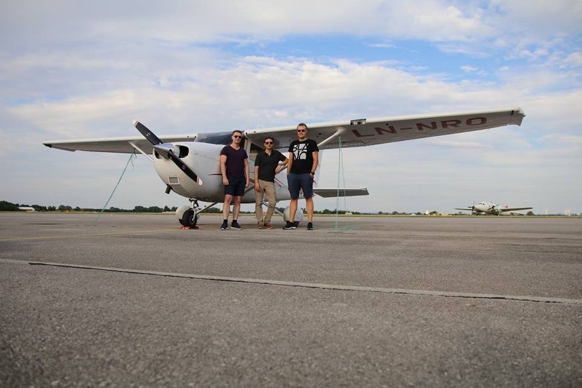

Hele crew-et etter landing i Wien. Ola, Michael og Anders. Foto: Michael Katz .

Å fly gjennom Wien, over Donau, er en fantastisk opplevelse. Å fortsette langs alpene til Salzburg, er like fantastisk. På turen opplevde vi også både snag  (feil på fly) og dårlig vær. En nødvendig, men ikke planlagt, landing gjorde at vi måtte forklare oss for politi og at vi fikk bot for landing etter stengetid.

Hele historien om langturen til Wien stod på trykk i Flynytt sitt reisebilag (våren 2018), men Michael har også skrevet om turen på  Flyåret 2017 – tur/retur Wien og Salzburg.

I det samme reisebilaget bidro også jeg med en artikkel. Det var om flyturen til vi hadde til Duxford, som i sin tid også ble blogget om . 

<figure>

<figcaption class="caption">
Småflykameratene Ola og Anders (undertegnede) figurerer på forsiden til selveste Flynytt sitt reisemagasin i 2018. Historier fra to av turene våre, til Wien og Duxford, stod på trykk der. Bildet på forsiden ble tatt av Michael , som også har vært med på alle langturene våre.
</figcaption>
</figure>